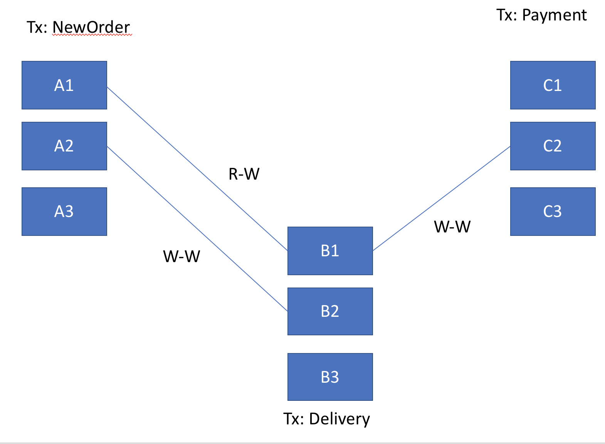
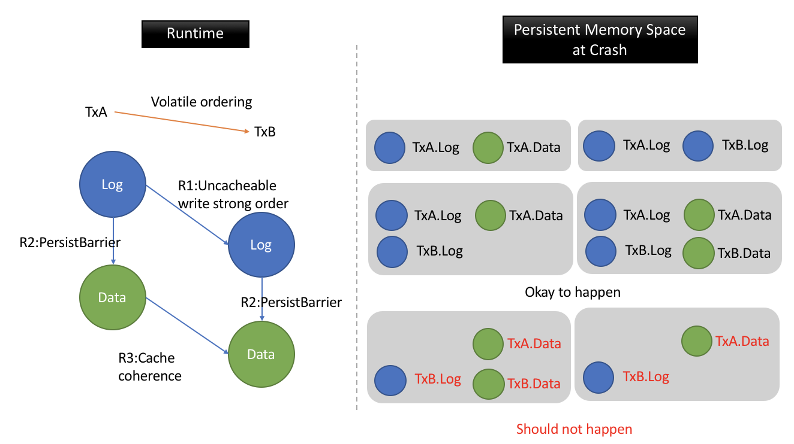

[TOC]

------


## Offline Chopper

### What is the input of the chopper

Workload of transactions and their memory access patterns. 

Some assumptions of the workload: 

- A transaction or its type must be identifiable. For example, a transaction can be identified as "MakePaymentTx". This enables runtime scheduler to refer to a conflicting transaction. 
- Memory accesses must be identifiable. For example, updates to "BankAccount1". 

### What does the chopper do 

The chopper does something similar to the offline analysis of Callas:

- It rearranges instructions and groups them into pieces. 
- It creates conflict edges(R-W, W-W) between pieces from various transactions. 

### What is the output of the chopper

The output is a depdency graph of pieces between transactions. For example:



### What is the structure of the transaction and piece 

```
Transaction{
    Piece1{
        UndoLog()
        SFENCE
        MutateData()
    }
    
    Piece2{
		...
    }
    
    Piece3{
        ...
    }
    
    COMMIT()
}

```


## Runtime Scheduling 

### Design and Data Structures


- **TxTracker**: An abstract global data structure that keeps track of running pieces and transactions. 

- **VersionTracker**:  An abstract global data structure that keeps track the data versions. Or this can be enabled by object wrapping, where the library boxes all objects with a version field, to prevent contention.

- **PieceBuf**: A local buffer to store pieces that cannot be run yet. 

- **TxDeps**: A local dependency tracker that indicates what are remote conflicting transactions that the local transaction depends on. 

- **Logs**: Undo logs 

  

### Overview 

A per-core scheduler thread is responsible for executing the transactions in the correct order, as well as making the data persistent. Upon receiving a dispatched transaction, the scheduler will execute the transaction's pieces in the program order. 

When executing a particular piece, the scheduler will first have to check with scheulers' from other cores, to 1) find out if there are any conflicting pieces that have already been execting [@a1](#a1),  2) find out if all the conflicting pieces from its dependency sources have been executed. [@a2](#a2)

If there are conflicting pieces running on other cores, the scheduler will have to delay the execution of this piece by placing it into a pending piece buffer (`PieceBuf`), and add that already running transaction as its dependency source (`TxDeps`) . It will then try to execute another piece . The scheduler will simply block when no other pieces can be run from this transaction. [@a3](#a3)

If there are no conflicting pieces running on this thread, the scheduler will execute the piece and marking the piece as running in `TxTracker`. Undo logging is inserted at the beginning of each piece followed by a `sfence`. The pieces could then be run after the undo logging is persisted. [@a5](#a5)

On finishing executing a piece, the scheduler will mark this piece as finished (`TxTracker`) and run the next piece. 

When all the pieces have been sucessfully executed, the scheduler needs to check if all its dependency sources have been committed. If not, it will have to busy wait for them [@a3](#a3); if yes, the scheduler will compute a TID based on its dependency sources, and persist TID and commit the transaction.[@a6](#a6) [@a4](#a4) 

```c
/* Pesudo-Code For Executing Transaction */
void run_tx(Transaction tx){
    while(has_next_piece(tx)){
        piece = get_next_piece(tx, piece_buf);
        
        if(can_run(piece, tx_tracker)){
            execute_piece(piece);
        } else {
            add_dep(tx_deps);
            if(is_last_piece(piece, tx))
                spin();
            else
	            enque_buf(piece, piece_buf);
        }
    }
	
    ASSERT(NO_MORE_PIECES(tx));
    
    while(!can_commit(tx)) {
        spin();
    }
    
    commit();
}

/* Pesudo-Code for Executing a piece */
void execute_piece(Piece piece) {
    mark_running(piece);
	piece.undo_log();
    
    PersistBarrier();
    
    piece.mutate_data();
    advance_write_version(); //Only advance write-set versions
    mark_done(piece);
}
```


### Details

#### A1

#### 	How to find out if there are conflicting pieces running?

> Assuming information of all conflicting pieces and their respective transactions are known, a global data structure can be used to keep track of the running pieces from each transaction at each core.  


#### A2

#### 	How to find out if dependency source transactions have already executed the conflicting pieces? 

> A global data structure could allow lookup of transaction and piece' identity can be shared among cores. A scheduler can find out what are pieces that conflicting transactions have ran, and delay its execution according to that information. 
>
> An alternative, more scalable design can rely on static mappings of transactions to cores when transactions are dispatched. Transactions are then partitioned to different cores based on some static information known in advance. In this way, information regarding running pieces could be distributed to cores. 


#### A3

#### 	Can the pieces from another transaction to be ran instead of blocking here?

> Intuitively, since the logging pieces from the next transaction can be run in parrallel with any part of another transaction (<u>proof required</u>), we can save time by avoiding busy waiting. 


#### A4

#### 	How to compute the TID?

> The computation of TID should avoid a single syncrhonization point, and I borrowed the idea of TID generation from Silo. The TID can be computed from the versions of data access by the transactions and the conflicting transactions.  In a nutshell, the TID of a commiting transaction should have the following gaurantee : 
>
> - Conflicting transactions (only Write-Write conflicts) should be ordered by their TIDs so that they can be recovered in the correct order. 
>
> 


#### A5

#### 	How to do logging?

> - Undo logging has to capture the dependecy between conflicting transactions so that the undo logs to the same location (data object) can be replayed in the correct order when recovery. **Only write-write conflicts need to be captured for recovery since read recovery does not concern of read events**. However, R-W conflicts still have to be obeyed at runtime. 
>
> - For conflicting W-W pieces, the cache coherence protocol at runtime is crucial to enforce correct-ordering of writes to the memory locations(R3). So that the resultant value at the conflicting locations will eventually be correct. And the Persist barriers between the logs and the data ensure that if data mutation is persisted, its associated undo logs must have been persisted(R2). In addition, the logs must be persist in the correct order as well(R1). (This is pretty much what Peter Chen proposes for DCT strand persistency) 
>
>   
>
>   
>
> - One particular troublesome case is when the logs are persist out of order. For example, when the TxA logs are missing in the persistent memory space, but TxB have persist its data. There are two options: 
>
>   1. Enforce the logs persist ordering at runtime as shown above. For example, use Uncacheable memory mapped region so that stores to the memory spaces are ordered. Or some other ways to implement strong persist atomicity. 
>   2. An alternative can be undo logs chaining. Undo logs containing logs of its dependency sources. The good thing about this approach is that logs can now be concurrent. But the overheads is increase traffic to NVM (This might be offset by the possibility of writes coalscing). 
>
> - An extra read/load might be necessary to obtain relevant information to construct an undo log. 
>
> - There has been research into how to do undo logging: namely, full logging versus incremental logging ([Hiding the long latency of persist barriers using speculative execution](https://dl.acm.org/citation.cfm?id=3080240))
>
>   
>
> Another option is to go with the **redo logging**: 
>
> When executing a transaction, the first piece will always contain redo loggings (either programmer labelled, or complier generated , as well as an `sfence` at the end of the first piece. It will then continue executing pieces which contain data mutations.
>
> However, redo logging has the issue of handling control flow/data dependencies within a transaction. For example, which arm to run for an `if..else..` block can only be determined at runtime. There a few ways to counter this issue, each comes with its own constrain. 
>
> 1. Disallow any  dynamic determined execution. This imposes a constrain on all the transactions such that stores/persists have to be determined statically prior to running. 
> 2. Use logical logging which enables replay of the entire history at recovery. This will enforce the recovery manager obey Read-Write/ Write-Read ordering between transactions as well. 
> 3. Add undo logging so that undo logs could help recover uncomitted transaction, and redo logs could be dynamcially modified based on the runtime execution. (Of course, this will come at a cost of doubling the NVM traffic)
>
> 


#### A6

#### 	How to commit a transaction?

> Correct recovery requires the final commit of a transaction to be ordered after all the data mutations from the transaction to be visible in NVM. (Otherwise if a crash happens between the commit persist and the pending data persists, the recovery manager will not be able to recover the transaction )
>
> However, there doesn't have to be a `sfence` between the previous transaction's commit and the next transaction since the reordering of them is fine [<u>TODO: proof required as the Peter's Paper seems to state otherwise, in particular the PB before lock in DST strand persistency</u>]


#### How to implement logging?

> **Format**:
>
> A log will have the below format : 
>
> ```
> LogEntry{
>     LogHeader{
>         len : variable size of the log data 
>         tid : info of the running transaction (eg: the original transaction id) 
>         vers: info of the version of data (eg: the version number)
>     }
>     LogData{
>         data: .....
>     }
> }
> 
> Graphically: 
> --------------------------------------------------------
> | len | tid | vers  | data....oh.....data....oh....data | 
> --------------------------------------------------------
> <-Log Header(fixed)-><-----Log data (variable size)----->
> ```
>
> 
>
> 
>
> **Implementation**:
>
> - Dedicated logging threads 
>
>  -  Logging thread should refrain from being involved in the concurrency management
>
>  -  Waits until all the other working thread exit
>
>  -  Use [channel](https://docs.rs/chan/0.1.21/chan/) to communicate with the working thread <u>asynchronously</u>:
>
>      -  **Receiving logs** created by working thread 
>         - !! log must be Sync+Send
>
> - The actual data might be deep copy into the log and send through the channel. (TODO: pass references around ) 
>
> - Logs are written to the log file using [libpmemlog](http://pmem.io/pmdk/manpages/linux/master/libpmemlog/libpmemlog.7.html)
>
>   
>
> **Ordering with other logs**:
>
> - **Logs from the same transaction** do not need to be ordered 
>
>   - these logs must be to different locations 
>   - write to the same location will only emit one log => the state before the first write 
>
> - **Logs from non-conflicting transactions** do not need to be ordered 
>
>   - Non-conflicting implies that the write sets are different 
>
> - **Logs from conflicting transactions**
>
>   - They have to be ordered with respect to the volatile order (follows the dependency graph)
>
>   - ````
>     log history : | log, log, log 
>     
>     if new log has to be ordered behind another log, insert a barrier before it
>     log history:  | LOG
>     ````
>
> 
>
> **Ordering with data persist**:
>
> - Log must persist before corresponding data, a `pmem_persit` at every log append (like what `libpmemlog` is doing)
> - Rely on non-temporal flushing without persist .... 
>
> 
>
> **libpmemlog**: 
>
> 1. Check the implementation and source codes of libpmemlog 
>
>    - how are data flushed into the pmem
>      - It calls `pmem_persist` or `pmem_msync` on every invocation of `append` 
>
>    


#### How to persist the data?

> **Implementation** :
>
> - Data will be flushed by calling  `pmem_flush` + `pmem_drain` / `pmem_persist` with virtual address before commit. Transaction commits after it. (TODO: users can in fact indicate to the library when a write is the last write in the transaction, and `pmem_flush` can then be early)
> - :question: This is done by the working thread?
>
> 
>
> **Commiting Transaction**
>
> - When a transaction commits: 
>   - If it has no dependency: persist data + persist commit. 
>   - if it has depedency running: persist data + wait for commit 
>   - if it has other transaction depending on it: 
>     - [There is room for optimizaiton here **to reduce number of pmem calls**:
>       - Some data might have already been flushed out of the cache by other depdendent thread. A redundant call is not necessary. 


## Checkpointing & Recovery

### Checkpointing

With undo logging, checkpointing becomes easy.  This is due to the below Lemma: 

**Lemma:** 

> A committed transaction will never roll-back as all transactions it depends on are already committed. Roll-back or abortion of  any un-committed transactions will not cause chained rollback for a committed transaction. 

Therefore, as soon as a transaction has been committed, the undo logs associated with the transaction are safe to be deleted. 


### Recovery 

With undo logging, recovery only needs to be concerned with uncommitted transactions. For all uncomitted transactions, the recovery manager will need to replay the ungo logs according to the correct ordering at runtime induced by W-W conflicts. (R-W conflicting pieces can be concurrent in recovery) 

Recovery should be fast since the recovery manager can skip any committed transactions and the number of uncomitted transactions should be bounded by the number of concurrent threads in the system. 


------


## Notes 

#### Integration of Rust features 

- [Dynamic and manual piece labelling] The idea of ownership might help to define the boundaries of pieces in terms of data dependency. 


## Questions 

- ~~How much information is known at offline chopping. (All transactions known in advance so they can be labelled?)~~
- Per-thread logging vs number of log threads? 
- Using own log APIs rather than libpmemlog because libpmemlog enforces barrier at each append?
- Write sets marking before hand so that logs are done at the beginning of a piece/tx, or logs are done on the fly?


## TODO:

- [ ] Proof that persistency is enforced with the current logging design.
- [ ] How to do checkpointing effectively. 


## Resources 

1. [Bridging the Programming Gap Between Persistent and Volatile Memory Using WrAP, CF2013](https://cpb-us-e1.wpmucdn.com/blogs.rice.edu/dist/7/3508/files/2014/07/frontiers2013-132tzqo.pdf)

   Paper that introduces a system using redo logs for ensuring atomic persistency. 

2. [Intel Architectures Optimization Manual Chapter 7.4, 7.6](https://www.intel.com/content/dam/www/public/us/en/documents/manuals/64-ia-32-architectures-optimization-manual.pdf) 

   Intro on non-temporal stores 

3. [Intel Software Dev Manual Volume 3](https://www.intel.com/content/www/us/en/architecture-and-technology/64-ia-32-architectures-software-developer-system-programming-manual-325384.html)

   Ch11.11: Memory types, eg: Uncachable memory, WC memory 

   Ch8.2: Multi-core memory ordering gaurantees 

