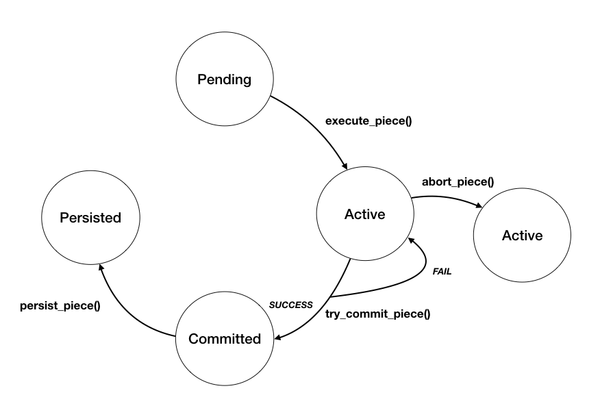
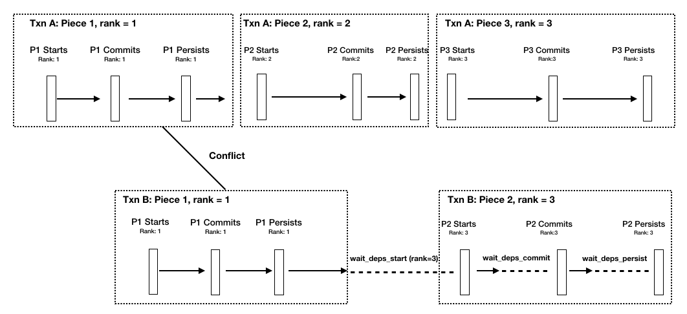

### Offline chopping of the transactions

We adopt transaction chopping of the workload to break transaction into small pieces, so that conflicting transactions which have to be serialzied can now be run in parallel. In particular, we construct SC graph of the independent data structures each transaction type will access, and assign each data structure with unique rank value.  We then re-order the operations in the transactions so that operations that access data structures with the same ranks will be in the same piece, so each piece within a transaction has a unique rank. Each chopped transaction will then consist of pieces with increasing ranks.  

- Paper referenced: [High-Performance ACID via Modular Concurrency Control](http://www.cs.cornell.edu/lorenzo/papers/Chao15Callas.pdf)


### Runtime dependency tracking and enforcement

##### How data structures are tagged with version information. 

- The data entries have to be associated with additional version information. The common behaviour that is expected by the transactional methods is described in the Trait TRef. The interface exposes methods that define the interactions between the transaction and the data entries. 
- Similar to [STO](http://www.read.seas.harvard.edu/~kohler/pubs/herman16type-aware.pdf), transactions are commiited by OCC, but the core functions used by the contention management are delegated to the functions implemented by the `TRef`trait. Such design also offers flexibility as users could define their own data type which implement the `TRef` traits. 

```rust
pub trait TRef {
    // Get pointer of the underlying data
	fn get_ptr(&self) -> *mut u8 		
	// Get the Layout of the data
    fn get_layout(&self) -> Layout; 	
	// Read the reference to the underlying data
    fn read(&self) -> &Any;				
	// Transaction write data to the local buffer
    fn write(&mut self, data: Box<Any>);
    // Try lock the underlying data version for write-set
    fn lock(&self, tid: Tid) -> bool; 		
    // Check the version of the read-set data before commit
    fn check(&self, cur_ver: Tid, own_tid: Tid) -> bool;
    // Get the writer for states of each piece when adding dependency
    fn get_writer_info(&self) -> Arc<TxnInfo>;
    // Set the most recent writer's transaction infomation
    fn set_writer_info(&mut self, Arc<TxnInfo>);
}
```


##### How to capture runtime dependency

- Pieces from a single transaction are run sequentially, and pieces from concurrent transactions are serialised with OCC. A piece has a lifecycle of 4 stages: pending, active, committed, persisted. 

  

- We record the read and write sets of a pieces as the piece is executed, and store the version information in a transaction-local tag for each read/write operation. (`TTag`) The tag will serve as a local snapshot of the data accessed, storing the reference to the underlying data structure. And it also stores the write value as a buffer so that a transaction can read-own-wirte. 
- Once all the read and write sets are recorded,  we will try to acquire the locks on the data structures in the write-set. If locking on any of the write data fails, the piece will be aborted and re-executed. 
- When all the locks from the write set are acquired successfully, we will check the local snapshot versions of data in the read-set against the underlying versions. If the version of the underlying data has changed, our local snapshot is then outdated, and the piece will abort. 
- Once a piece has locked all the write sets, and checked all the read set. It will get the last writer version of data from both sets, and add those transactions into its depdency set if those transactions have not been committed. 

```rust
// Algorithm 
fn execute_txn(){
	while hasNextPiece {
		let piece = get_next_piece();
		// Busy wait for dependencies to catch up
		wait_deps_start(piece.rank());
		execute_piece(piece);
		// Abort the entire transaction when it is needed
		if shouldAbort {
			abort_txn();
        }
    }
    // Wait for dependencies to commit
    wait_deps_commit();  
    commit_txn();
    // Wait for dependecies to persist
    wait_deps_persist();
    persist_txn();
}


fn execute_piece(piece) {
    let success = false;
    while !shouldAbort && !success {
        piece.run();
        success = try_commit_piece(piece.rank());
    } 
}

fn try_commit_piece(rank) {
    // Abort and re-run the piece if failed to lock on the write-set
    if !lock() {
        abort_piece()
    }
    // Abort and re-run if version on read-set changed during execution
    if !check() {
        abort_piece()
    }
    // Prepare undo logs 
    persist_logs();
    // Commit data to volatile space 
    install_data();
    // Persist data to non-volatile memory
    persist_data();
    // Clean up and success
    clean_up()
}

```


##### How to enforce the dependency

- Once the dependencies between running transaction instances are captured, the atomicity of the transactions are enforced by avoiding cross edges between conflicting transactions. The pieces from conflicting transaction instances are ran in a pipelined manner ([Callas Paper](http://www.cs.cornell.edu/lorenzo/papers/Chao15Callas.pdf)). A transaction that is about to execute/commit/persist a piece, has to wait for all its active dependencies to at least execute/commit/persist a piece with a higher or equal rank. 

  

- <u>(TODO： Proof of correctness of persistence in such way? )</u>


### Persistence of transaction

- We use a shadow DRAM to decouple the execution of the transaction from its persistence. Before each piece is committed to the volatile memory, we construct undo logs for all the data in the write-set. (Ref, why using undo logs, how to do the logging). 

- [FIXME: flushing in the piece or after all the pieces?]
- After the data is committed to the volatile memory, we will copy the data into the corresponding non-volatile memory space. 


z


#### Other Info 

Runtime: 

how to pass inputs and outputs from pieces [Impelementation]

How to handle aborts?

When to update version information with nested OCC? 


Implementation: 

mapping of pmem memory to the volatile memory

PMDK, non-temporal stores, drain and persist 


- Using OCC to ensure serializability across pieces 
  - http://ic3.news.cs.nyu.edu/techreport16.pdf